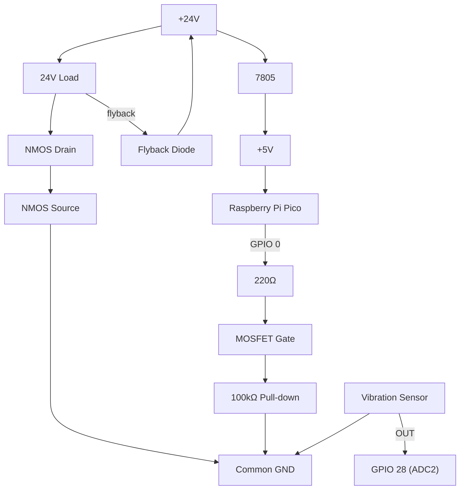

# cymbalamp

A C program for a cymbal lamp. Made for the Raspberry Pi Pico.

This project came into reality after finding a makeshift lamp for sale online, using an old cymbal and its stand. After realizing how cool it would be to have it turn on and off by hitting the cymbal, we decided to rebuild the circuit to make that possible. We achieved it by incorporating a Raspberry Pi Pico running the code in this repo, connected to a vibration sensor and a mosfet to switch the lamp when vibration is detected. Despite being a cool gimmick, it is a bit finicky, so a switch was added alongside the main power switch, that cuts off the Pico part of the circuit, making it behave as a normal lamp. If you wish to recreate this project, here is a material list and circuit diagrams.

## Circuit Diagram (Raspberry Pi Pico + 24 V Load)

### GPIO / ADC Mapping

| Function              | Pico Pin | Notes                         |
|-----------------------|----------|-------------------------------|
| MOSFET Gate           | GPIO 0   | Digital output                |
| Vibration Sensor ADC  | GPIO 28  | ADC2 (sensor signal)          |
| ADC Channel Select    | ADC2     | `adc_select_input(2)`         |
| Pico Logic Supply     | 5 V      | From 7805 regulator           |
| Common Ground         | GND      | Shared logic + power ground   |

### Power & Load Side (24 V, Low-Side Switching)

```text
            +24V
              |
              |
          +--------+
          | LOAD   |   Solenoid / Lamp 
          +--------+
              |
              |--------------------+
              |                    |
              |                 ┌──┴──┐
              |                 │     │
              |                 │ NMOS│  Logic-level N-MOSFET
              |                 │     │
              |                 └──┬──┘
              |                    |
              |                   GND
              |
        ┌───────────────┐
        │ Flyback Diode │  (Polarity Protection)
        └─────|<|──────┘
              |
             +24V
```

Notes:
- Flyback diode: 1N5819 / 1N4007 / Schottky preferred
- MOSFET examples: IRLZ44N, AO3400, FQP30N06L
- Source → GND, Drain → Load

### Logic & Control Side (5 V + Pico)

```text
              +24V
                |
              [ 7805 ]
                |
               +5V
                |
        +----------------+
        | Raspberry Pi   |
        | Pico (RP2040)  |
        |                |
        | GPIO 0 --------+--[220Ω]----+---- Gate (NMOS)
        |                |            |
        |                |          [100kΩ]
        |                |            |
        | GND -----------+------------+---- GND
        |                |
        | GPIO 28 (ADC) -+---- Sensor OUT
        +----------------+
```
Notes:
- 220 Ω gate resistor: limits inrush current from GPIO
- 100 kΩ pull-down: keeps MOSFET OFF during reset / boot
- Common ground is mandatory

### Sensor (ADC Input)

```text

 [ Vibration / Piezo Sensor ]
  |
  +---- GPIO 28 (ADC2) ----- < 3.3V ---+ MOSFET
  |
 GND
```

## Mermaid diagram


